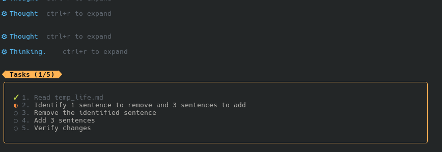

# Omnicode

**The best Claude Code alternative for developers who want multi-provider freedom.**

[简体中文](README.zh-CN.md)
[繁體中文](README.zh-TW.md)

## Why Omnicode?

We created Omnicode because we were tired of switching between different CLI coding tools that didn't solve our particular problems. One tool locked us into a single provider. Another had a great harness but no flexibility. We wanted both -- and we built it.

**The Inspiration:**

- From Anthropic's **Claude Code**: The exceptional agentic coding experience -- tight loops, structured tool use, and a harness that stays out of your way.
- From OpenAI's **Codex**: The power and flexibility of a great CLI harness with development modes and project-level context.

**The Reality:**

Not everyone wants to be locked into a single provider. Whether you're using:

- Local models via **Ollama**
- **DeepSeek** for long-context tasks
- **GLM** (Zhipu) for multilingual coding
- **OpenRouter** for provider routing and failover
- **Anthropic** and **OpenAI** directly
- Any OpenAI-compatible API

Omnicode gives you the best of both worlds: a Claude Code-level agentic coding experience with the freedom to use any provider you choose.

**The Result:**

The best CLI tool for agentic coding, period. If you're looking for a powerful, flexible, and beautiful CLI for AI-assisted development -- welcome to Omnicode.

---

## Custom Features (Fork Additions)

Features added to this fork that may not be in the original repo.

> **Legend:**
> - `[ ]` = Not yet in the original repo (Nano-Collective/nanocoder)
> - `[x]` = Already contributed to or present in the original repo

- [ ] Status line position control (`/statusline position top|bottom`) + `/settings` integration
- [ ] Enhanced compact file diff display with inline word highlighting
- [ ] Working indicator with animated gear and timer (`⚙ Working... (12s)`)
- [ ] Thinking indicator with animated gear and final duration (`⚙ Thought (5s)`)
- [x] Multiline cursor navigation and word-jump fixes
- [ ] `$ARGUMENTS` pass-through for commands without declared parameters
- [ ] Styled task list display with progress count and themed borders
- [ ] Custom fork banner with ASCII art
- [ ] Optimized welcome header with version, model, directory, and git branch
- [ ] Conditional tips display (first run or after 12+ hours)
- [ ] Condensed agent override messages (single line instead of multiple)
- [ ] TUI rendering overhaul: dual screen modes (inline/fullscreen via `--alt-screen`) with scrolling, reliable `/clear`, and graceful exit

### Task List Display

The task list now renders in a styled box with the user's preferred title shape, theme colors, and a progress counter:



### TUI Screen Modes

Two rendering modes, mirroring what Claude Code and Codex ship:

- **Inline (default)** — renders on the main screen; finished messages print once into the terminal's native scrollback, so your terminal's scrollbar, mouse wheel, and search (Ctrl+Shift+F) work as usual. The transcript stays in the terminal after exit.
- **Fullscreen** (`--alt-screen` flag, or `"alternateScreen": true` in preferences) — a fixed-height layout on the alternate screen buffer with in-app scrolling: mouse wheel (3 rows/tick) and PgUp/PgDn (half a page), with a scroll indicator and automatic snap-back to bottom on new output. Note: with mouse reporting active, select text with Shift+drag. `--no-alt-screen` forces inline mode over the preference.

In both modes `/clear` fully resets the terminal to a fresh welcome banner, and exiting (Ctrl+C or `/exit`) erases the input UI cleanly, leaving the transcript and a farewell instead of a dead input box.

---

Omnicode exists because I got tired of switching from CLI to CLI. Rather than forcing closed agentic coding tools into shape with environment hacks and proxies around private binaries, I contribute to Nanocoder and shape this fork around the features I actually need. Every line is open — no unnecessary telemetry, nothing hidden — with the goal of being a genuinely great alternative to the big-name coding CLIs. Bring your own model, keep your code on your machine.

Built by the [Nano Collective](https://nanocollective.org), a community collective building AI tooling not for profit, but for the community. Omnicode runs agentic coding on the model of your choice: local models via Ollama, or any OpenAI-compatible API such as OpenRouter, Anthropic, and Google. You decide which provider runs your code and where your data goes. No closed-source features and no paid tiers gating the useful parts: **privacy-respecting**, **local-first**, and **open for all**.


---


<a href="https://www.star-history.com/#Nano-Collective/nanocoder&Date">
 <picture>
   <source media="(prefers-color-scheme: dark)" srcset="https://api.star-history.com/svg?repos=Nano-Collective/nanocoder&type=Date&theme=dark" />
   <source media="(prefers-color-scheme: light)" srcset="https://api.star-history.com/svg?repos=Nano-Collective/nanocoder&type=Date" />
   
 </picture>
</a>

## Quick Start

```bash
npm install -g @nanocollective/omnicode
omnicode
```

Also available via [Homebrew](docs/getting-started/installation.md#homebrew-macoslinux) and [Nix Flakes](docs/getting-started/installation.md#nix-flakes).

### CLI Flags

Specify provider, model, and starting mode directly:

```bash
# Non-interactive mode with specific provider/model
omnicode --provider openrouter --model google/gemini-3.1-flash run "analyze src/app.ts"

# Interactive mode starting with specific provider
omnicode --provider ollama --model llama3.1

# Flags can appear before or after 'run' command
omnicode run --provider openrouter "refactor database module"

# Boot directly into a development mode (normal, auto-accept, yolo, plan)
omnicode --mode yolo
omnicode --mode plan run "audit the auth module"

# Fullscreen mode with in-app scrolling instead of the inline default
omnicode --alt-screen
```

### Screen Modes

Nanocoder supports two rendering modes, mirroring what Claude Code and Codex ship:

- **Inline (default)** — renders on the main screen; finished messages print once into the terminal's native scrollback, so your terminal's scrollbar, mouse wheel, and search work as usual. The transcript stays in the terminal after you exit.
- **Fullscreen** (`--alt-screen` flag, or `"alternateScreen": true` in preferences) — a fixed-height layout on the alternate screen buffer with in-app scrolling: mouse wheel and PgUp/PgDn, with a scroll indicator and automatic snap-back to bottom on new output. `--no-alt-screen` forces inline mode even if the preference is set.

In both modes, `/clear` fully resets the terminal to a fresh welcome banner, and exiting (Ctrl+C or `/exit`) erases the input UI cleanly, leaving the transcript and a farewell instead of a dead input box.

## Documentation

Full documentation is available online at **[docs.nanocollective.org](https://docs.nanocollective.org/nanocoder/docs)** or in the [docs/](docs/) folder:

- **[Getting Started](docs/getting-started/index.md)** - Installation, setup, and first steps
- **[Configuration](docs/configuration/index.md)** - AI providers, MCP servers, preferences, logging, timeouts
- **[Features](docs/features/index.md)** - Skills (commands, subagents, tools, event triggers), the per-project daemon, checkpointing, development modes, task management, and more
- **[Commands Reference](docs/features/commands.md)** - Complete list of built-in slash commands
- **[Keyboard Shortcuts](docs/features/keyboard-shortcuts.md)** - Full shortcut reference
- **[Community](docs/community.md)** - Contributing, Discord, and how to help

## Why a collective

Omnicode is built by the Nano Collective rather than a company, and that shapes the tool itself. There are no paid tiers, no telemetry quietly shipping your prompts somewhere, and no roadmap steered by what monetises best — the people building it are the people using it. Building in the open as a collective means the harness stays multi-provider on principle: you are never locked to one vendor's model, and the conventions, tests, and release standards are shared across every Nano Collective project so the work stays legible and contributable.

It is also bigger than one tool. The collective is assembling an open ecosystem of AI tooling — see the [other projects](https://nanocollective.org) — and contributors who show up now help shape what that becomes.

## Sponsors

Omnicode is built not for profit, but for the community, and that work is funded by sponsors. [Become one](https://nanocollective.org/sponsor).

### [Atlas Cloud](https://www.atlascloud.ai/console/coding-plan)

<p>
  <a href="https://www.atlascloud.ai/console/coding-plan" title="Atlas Cloud">
    <picture>
      <source media="(prefers-color-scheme: dark)" srcset="https://nanocollective.org/sponsors/atlas-cloud-white.png">
      
    </picture>
  </a>
</p>

> Atlas Cloud is a full-modal AI inference platform that gives developers a single AI API to access video generation, image generation, and LLM APIs. Instead of managing multiple vendor integrations, you connect once and get unified access to 300+ curated models across all modalities.

Check out [Atlas Cloud's new coding plan promotion](https://www.atlascloud.ai/console/coding-plan) for more budget-friendly API access.

## Community

The Nano Collective is a community collective building AI tooling for the community, not for profit. We'd love your help.

- **Contribute**: See [CONTRIBUTING.md](CONTRIBUTING.md) for development setup and guidelines.
- **The collective**: [nanocollective.org](https://nanocollective.org) · [docs](https://docs.nanocollective.org) · [GitHub](https://github.com/Nano-Collective) · [Discord](https://discord.gg/ktPDV6rekE)
- **Support the work**: The [Support page](https://docs.nanocollective.org/collective/organisation/support) covers donations and sponsorship.
- **Paid contribution**: The [Economics Charter](https://docs.nanocollective.org/collective/organisation/economics-charter) sets out how scoped paid bounties work.
